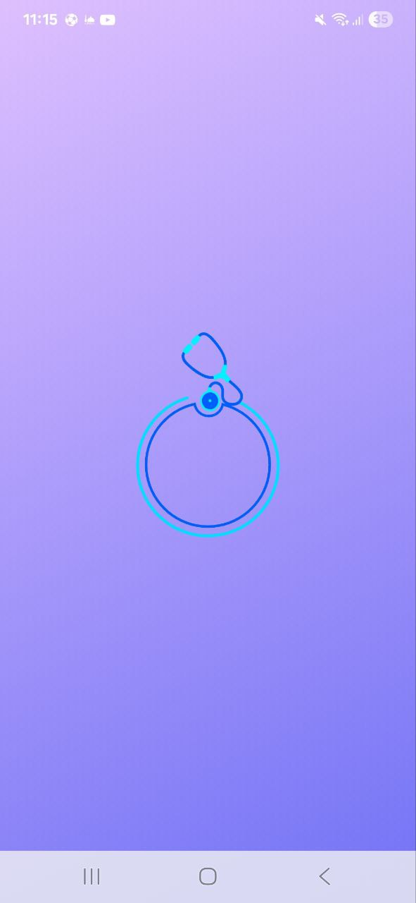
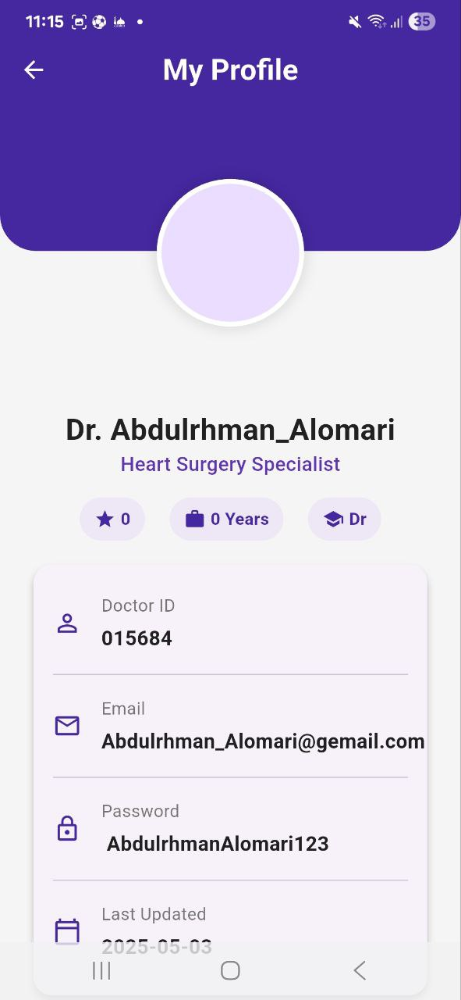
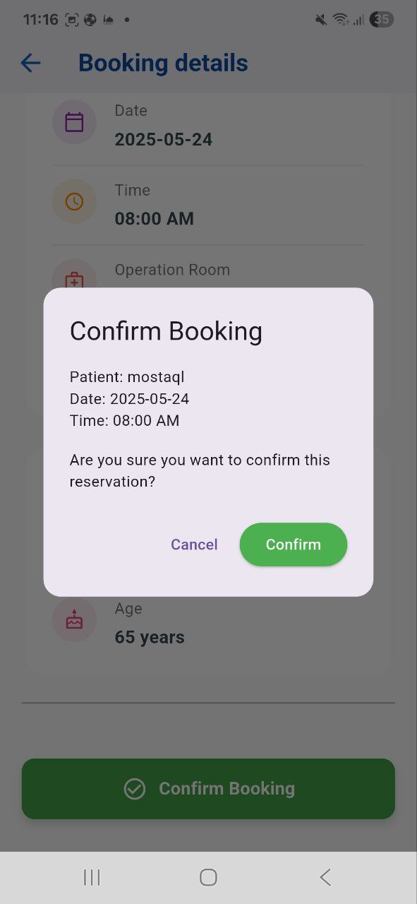

# 🏥 Surgery Booking App

A Flutter application for scheduling surgical operation appointments in hospitals.

> 🚧 **Note:** The app currently uses local storage only. Backend structure is already included but integration is pending.

---

## 📱 Features

- 📋 Book surgical operation appointments
- 🛏 View and manage available patient rooms
- 🧑‍⚕️ Doctor login and appointment management
- 🧾 Confirmed bookings & history
- 🎨 Animations and modern UI/UX
- 🗃 Local storage with models prepared for backend

---

## 🎥 Demo Video

Watch a short demo of the Surgery Booking App in action:

[](https://youtube.com/shorts/RHh3JU8DoLY)

---

## 📸 App Screenshots

Here are sample screens from the app showcasing different functionalities:

| Splash | Login | Home |
|--------|-------|------|
|  |  |  |

| Drawer | Profile | Calendar |
|--------|---------|----------|
|  |  |  |

| Booking Details | Confirmed Booking | Finish Booking |
|------------------|-------------------|----------------|
|  |  |  |

| Operation Rooms | Patient Rooms | Patient Info |
|------------------|----------------|---------------|
|  |  |  |

| All Operations | Edit Operation | About Page |
|----------------|----------------|-------------|
|  |  |  |

---

## 🚀 Getting Started

### Requirements

- Flutter SDK (Latest stable)
- Android Studio or VS Code
- Dart enabled

### Steps

```bash
git clone https://github.com/AbdOmari/surgery_booking_app.git
cd surgery_booking_app
flutter pub get
flutter run
